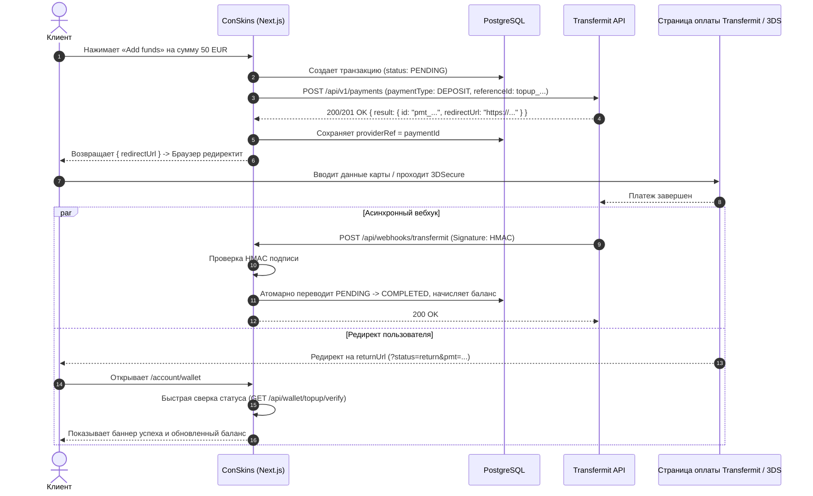

# Полное руководство и тонкости интеграции Transfermit API

Настоящее руководство содержит исчерпывающее описание архитектуры, протоколов, форматов данных, краевых случаев и тонкостей работы с платежным шлюзом **Transfermit**, собранных на основе исходного кода плагина `Transfermit-v1.0.8`, официальной документации и реального опыта интеграции в Next.js / TypeScript.

---

## Содержание
1. [Базовые параметры и аутентификация](#1-базовые-параметры-и-аутентификация)
2. [Жизненный цикл платежа (Flow)](#2-жизненный-цикл-платежа-flow)
3. [Создание платежа (DEPOSIT): Спецификация и тонкости](#3-создание-платежа-deposit-спецификация-и-тонкости)
   - [Критическая валидация телефона (Phone Gotcha)](#критическая-валидация-телефона-phone-gotcha)
   - [Обязательные поля Customer](#обязательные-поля-customer)
   - [Адрес плательщика (Billing Address)](#адрес-плательщика-billing-address)
   - [Методы оплаты (Payment Methods)](#методы-оплаты-payment-methods)
4. [Обработка Redirect URL и Hosted Checkout](#4-обработка-redirect-url-и-hosted-checkout)
5. [Вебхуки и проверка подписи (HMAC-SHA256)](#5-вебхуки-и-проверка-подписи-hmac-sha256)
   - [Алгоритм валидации подписи](#алгоритм-валидации-подписи)
   - [Формат входящего вебхука](#формат-входящего-вебхука)
   - [Идемпотентность](#идемпотентность)
6. [Статусы платежей и стейт-машина](#6-статусы-платежей-и-стейт-машина)
7. [Проверка статуса платежа по API (Polling / On-Return)](#7-проверка-статуса-платежа-по-api-polling--on-return)
8. [Возвраты (Refunds)](#8-возвраты-refunds)
9. [Тестовые данные (Sandbox & Test Cards)](#9-тестовые-данные-sandbox--test-cards)
10. [Чек-лист для продакшена и переменные окружения](#10-чек-лист-для-продакшена-и-переменные-окружения)

---

## 1. Базовые параметры и аутентификация

- **Базовый эндпоинт API**:
  `https://app.transfermit.com/api/v1/payments`
- **Формат протокола**: REST / JSON по HTTPS.
- **Аутентификация**: Bearer Token в стандартном HTTP-заголовке `Authorization`:
  ```http
  Authorization: Bearer <TRANSFERMIT_API_KEY>
  Content-Type: application/json
  Accept: application/json
  User-Agent: ConSkins-NextJS/1.0.0
  ```
- **Секреты**:
  - `TRANSFERMIT_API_KEY`: API ключ мерчанта (используется для исходящих запросов).
  - `TRANSFERMIT_WEBHOOK_SECRET`: секретный ключ для проверки HMAC-SHA256 подписи входящих вебхуков.

---

## 2. Жизненный цикл платежа (Flow)



---

## 3. Создание платежа (DEPOSIT): Спецификация и тонкости

### Критическая валидация телефона (Phone Gotcha!)

Самая частая ошибка при интеграции с Transfermit — **400 Bad Request**:
```json
{
  "timestamp": "2026-09-04T08:48:00.707Z",
  "status": 400,
  "error": "Bad Request",
  "message": "Validation failed: customer.phone The phone must be in the format '123 456' or empty",
  "path": "/api/v1/payments"
}
```

#### Правило валидации:
1. Знак `+` **запрещен**. Номера вроде `+44 7412 839910` вызывают ошибку валидации.
2. Номер должен состоять **ровно из двух групп цифр, разделенных одним пробелом** (код страны + номер), например: `'44 7412839910'` или `'1 5551234567'`.
3. Поле является опциональным (`"or empty"`). Если у пользователя нет подтвержденного телефона, поле `phone` **лучше вообще не передавать** или передавать пустым.

#### Реализация нормализации:
```typescript
export function formatTransfermitPhone(phone?: string | null): string | undefined {
  if (!phone) return undefined;
  const digits = phone.replace(/\D/g, "");
  if (!digits || digits.length < 4) return undefined;
  // Формат: 2 цифры кода страны, пробел, оставшаяся часть
  return `${digits.slice(0, 2)} ${digits.slice(2)}`;
}
```

---

### Обязательные поля Customer

```json
"customer": {
  "referenceId": "usr_cmtmpcxhr0000vl8ou8gox219",
  "firstName": "John",
  "lastName": "Doe",
  "email": "user@example.com",
  "phone": "44 7412839910",
  "ip": "194.28.112.5"
}
```

- `referenceId`: ID пользователя в вашей системе (строка).
- `firstName`: Имя. Не должно быть пустым (если неизвестно, передавать `"Customer"`).
- `lastName`: Фамилия. Не должна быть пустой (если неизвестно, передавать `"Customer"` или фамилию из профиля).
- `email`: Корректный валидный email. Для Steam-пользователей без email можно использовать fallback `${steamId64}@conskins.com`.
- `ip`: IP-адрес клиента (извлекать из заголовков `CF-Connecting-IP`, `X-Forwarded-For` или `X-Real-IP`). Не должен содержать порт.

---

### Адрес плательщика (Billing Address)

Для цифровых товаров и пополнения баланса физический адрес часто отсутствует в профиле, однако API валидирует наличие полей адреса:

```json
"billingAddress": {
  "addressLine1": "Dept 6790, 196 High Road",
  "addressLine2": null,
  "city": "London",
  "countryCode": "GB",
  "postalCode": "N22 8HH",
  "state": null
}
```

- `countryCode`: Двухбуквенный ISO 3166-1 alpha-2 код (например: `"GB"`, `"US"`, `"DE"`).
- `addressLine1`, `city`, `postalCode`: Обязательные непустые строки. Если адреса нет в БД, передавать корпоративный адрес сервиса или дефолтные значения цифровой поставки.

---

### Методы оплаты (Payment Methods)

По умолчанию используется `"BASIC_CARD"`. Transfermit также поддерживает:

| Код метода | Описание | Требует карточные данные |
|---|---|:---:|
| `BASIC_CARD` | Банковские карты Visa, MasterCard, Amex | Опционально (hosted) |
| `BANKTRANSFER` | Прямой банковский перевод | Нет |
| `SOFORT` / `GIROPAY` | Немецкий интернет-банкинг | Нет |
| `IDEAL` | Нидерландский iDEAL | Нет |
| `BLIK` | Польский мобильный платеж BLIK | Нет |
| `BANCONTACT` | Бельгийский Bancontact | Нет |
| `MBWAY` / `MULTIBANCO` | Португальские платежи | Нет |
| `APPLEPAY` / `GOOGLEPAY` | Мобильные кошельки | Нет |
| `SKRILL` / `NETELLER` | Электронные кошельки | Нет |
| `OPENBANKING` | Европейский Open Banking | Нет |
| `CRYPTO` | Криптовалюты (BTC, ETH, USDT) | Нет |

---

## 4. Обработка Redirect URL и Hosted Checkout

При создании платежа без передачи прямого блока `card` (или если карта требует 3DSecure) API возвращает:

```json
{
  "result": {
    "id": "pmt_4f9a8b1c-7e3d",
    "state": "AWAITING_REDIRECT",
    "redirectUrl": "https://checkout.transfermit.com/pay/4f9a8b1c-7e3d",
    "amount": 50.0,
    "currency": "EUR"
  }
}
```

### Важные нюансы извлечения URL:
В зависимости от версии API и используемого шлюза поле с ссылкой может находиться на разных уровнях ответа:
```typescript
const redirectUrl =
  res?.result?.redirectUrl ||
  res?.result?.url ||
  (res as any)?.redirectUrl ||
  (res as any)?.url;
```
Если URL найден, фронтенд немедленно выполняет переход:
```typescript
window.location.href = redirectUrl;
```

---

## 5. Вебхуки и проверка подписи (HMAC-SHA256)

Transfermit отправляет асинхронные HTTP POST запросы на указанный в платеже `webhookUrl`.

### Алгоритм валидации подписи
Подпись передается в заголовке `Signature` (или `signature`). Она вычисляется как HMAC-SHA256 от **сырого тела запроса** (raw body string) с использованием секрета мерчанта `TRANSFERMIT_WEBHOOK_SECRET`.

> [!CAUTION]
> **Нельзя парсить JSON до вычисления HMAC!**
> Любое изменение пробелов или порядка ключей приведет к несовпадению хеша. Используйте `await request.text()` в Next.js.

```typescript
import crypto from "crypto";

const rawBody = await request.text();
const signature = request.headers.get("signature") || request.headers.get("Signature");

const expectedSignature = crypto
  .createHmac("sha256", webhookSecret)
  .update(rawBody)
  .digest("hex");

const sigBuf = Buffer.from(signature || "");
const expBuf = Buffer.from(expectedSignature);

const isValid = sigBuf.length === expBuf.length && crypto.timingSafeEqual(sigBuf, expBuf);
if (!isValid) {
  return NextResponse.json({ error: "Invalid signature" }, { status: 400 });
}
```

### Формат входящего вебхука

```json
{
  "id": "pmt_4f9a8b1c-7e3d",
  "paymentType": "DEPOSIT",
  "state": "COMPLETED",
  "referenceId": "topup_cmtx12345678",
  "amount": 50.00,
  "currency": "EUR",
  "paymentMethod": "BASIC_CARD",
  "paymentMethodDetails": {
    "cardLast4": "4242",
    "cardBrand": "VISA"
  }
}
```

### Идемпотентность
Вебхуки могут приходить повторно при сетевых сбоях. Обработчик обязан быть **строго идемпотентным**:
- Сохраняйте `providerRef = paymentId` в базе данных (`@unique`).
- Если транзакция с таким `providerRef` уже имеет статус `COMPLETED`, запрос должен немедленно вернуть `200 OK`, не начисляя средства второй раз.

---

## 6. Статусы платежей и стейт-машина

| Статус Transfermit | Значение | Действие в ConSkins |
|---|---|---|
| `PENDING` | Платеж создан, ожидает действий | Транзакция создается со статусом `PENDING` |
| `CHECKOUT` / `AWAITING_REDIRECT` | Ожидание перехода на оплату | Ожидание |
| `AWAITING_APPROVAL` / `AWAITING_RETURN` | Клиент проходит 3DS / авторизацию | Ожидание |
| `COMPLETED` | **Успешно оплачено** | Атомарный перевод в `COMPLETED`, начисление баланса в кошелек |
| `DECLINED` | Отклонено банком-эмитентом | Перевод в `FAILED` |
| `ERROR` | Ошибка процессинга / валидации | Перевод в `FAILED` |
| `CANCELLED` | Платеж отменен покупателем | Перевод в `FAILED` |
| `CHARGEBACK` | Чарджбек / диспут | Блокировка/списание суммы |
| `PARTIAL_COMPLETE` | Частичная оплата | Требует ручной сверки |

---

## 7. Проверка статуса платежа по API (Polling / On-Return)

Когда клиент завершает оплату на 3DSecure или Hosted Checkout, браузер редиректит его на `returnUrl`:
`https://conskins.com/account/wallet?status=return&ref=topup_...&pmt=pmt_...`

Из-за сетевых очередей вебхук может задержаться на несколько секунд. Чтобы пользователь не ждал:
1. Фронтенд вызывает эндпоинт верификации:
   `GET /api/wallet/topup/verify?pmt=pmt_...`
2. Бэкенд запрашивает Transfermit API:
   `GET https://app.transfermit.com/api/v1/payments/{payment_id}`
3. Если статус уже `COMPLETED`, баланс зачисляется мгновенно, и пользователь сразу видит результат.

---

## 8. Возвраты (Refunds)

Transfermit поддерживает полные и частичные возвраты через тот же эндпоинт платежей:

```http
POST /api/v1/payments
Authorization: Bearer <API_KEY>
Content-Type: application/json

{
  "paymentType": "REFUND",
  "parentPaymentId": "pmt_4f9a8b1c-7e3d",
  "amount": 25.00,
  "currency": "EUR"
}
```

Ответ при успешном возврате содержит статус `COMPLETED` и новый `id` транзакции возврата.

---

## 9. Тестовые данные (Sandbox & Test Cards)

Для тестирования шлюза в режиме Sandbox используйте тестовые карты:

| Номер карты | 3DS Сценарий | Ожидаемый результат |
|---|---|---|
| `4000 0000 0000 0002` | 3DS включен | **Успешная авторизация** (Код OTP: `12345`) |
| `4242 4242 4242 4242` | 3DS включен | **Отклонено (Declined)** |
| `4000 0000 0000 0408` | Без 3DS | **Успешная авторизация** |
| `4000 0000 0000 0416` | Без 3DS | **Отклонено (Declined)** |
| `4111 1111 1111 1111` | Любой | **PARTIAL_COMPLETE** |

- **Срок действия (Expiry)**: Любая будущая дата (например, `12/28`).
- **CVC**: Любые 3 цифры (например, `123`).
- **3DS OTP код**: `12345`.

---

## 10. Чек-лист для продакшена и переменные окружения

```env
# Transfermit API Key (из личного кабинета мерчанта)
TRANSFERMIT_API_KEY="sk_live_..."

# Секрет вебхука (должен совпадать со значением в Webhook Settings кабинета Transfermit)
TRANSFERMIT_WEBHOOK_SECRET="whsec_..."

# Базовый URL API (по умолчанию https://app.transfermit.com/api/v1/payments)
TRANSFERMIT_API_URL="https://app.transfermit.com/api/v1/payments"
```

### Проверочный чек-лист перед запуском в прод:
- [x] URL вебхука зарегистрирован в кабинете Transfermit: `https://conskins.com/api/webhooks/transfermit`.
- [x] Заголовок `Signature` проверяется через `crypto.timingSafeEqual` по секрету.
- [x] Поле `customer.phone` нормализуется в формат `'123 456'` без знака `+` либо опускается.
- [x] Адрес плательщика (`billingAddress`) всегда заполнен валидными ISO-кодами (`countryCode: "GB"`).
- [x] Идемпотентность леджера: повторные вебхуки не начисляют баланс повторно.
- [x] Локальная проверка возврата (`/api/wallet/topup/verify`) сверяет статус при редиректе пользователя.
